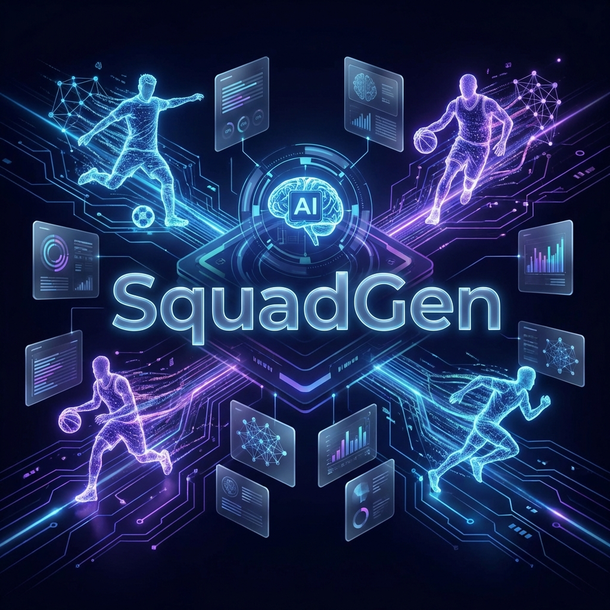

# ⚡ SquadGen Landing Page

<div align="center">
  
  
  <p align="center">
    <strong>Elevando el balanceo de equipos al siguiente nivel con IA de vanguardia.</strong>
  </p>

  [](https://reactjs.org/)
  [](https://vitejs.dev/)
  [](https://tailwindcss.com/)
  [](https://deepmind.google/technologies/gemini/)
</div>

---

## 🌟 Visión General

**SquadGen** es una landing page de alto impacto diseñada para presentar la solución definitiva en gestión de equipos deportivos. Utilizando la potencia de **Google Gemini AI**, SquadGen analiza las habilidades de los jugadores para crear enfrentamientos equilibrados, competitivos y emocionantes.

Esta landing page no es solo información; es una experiencia visual premium que utiliza animaciones 3D basadas en scroll para cautivar al usuario desde el primer segundo.

## ✨ Características Principales

- 🎨 **Estética Premium**: Diseño Dark Mode con efectos de Glassmorphism y una paleta de colores eléctrica.
- 🎬 **Hero Inmersivo**: Animación de secuencia de imágenes (240 frames) sincronizada con el scroll para un efecto 3D fluido.
- 📱 **PWA Ready**: Totalmente instalable en dispositivos móviles para una experiencia nativa.
- ⚡ **Rendimiento Óptimo**: Optimización de carga de imágenes mediante Canvas y hooks personalizados.
- 🛠️ **Arquitectura Moderna**: Construido con React 19 y las últimas capacidades de Tailwind CSS v4.

## 🛠️ Stack Tecnológico

| Herramienta | Propósito |
| :--- | :--- |
| **React 19** | Biblioteca principal de UI |
| **Vite 7** | Herramienta de construcción ultra rápida |
| **Tailwind v4** | Estilizado moderno y utilitario |
| **Framer Motion** | Animaciones de interfaz suaves |
| **Lucide Icons** | Set de iconos minimalistas |
| **Canvas API** | Renderizado de secuencia de imágenes de alto rendimiento |

## 🚀 Instalación y Configuración

Sigue estos pasos para ejecutar el proyecto localmente:

1. **Clona el repositorio**
   ```bash
   git clone https://github.com/julianBI/squadgen-landingPage.git
   ```

2. **Instala las dependencias**
   ```bash
   npm install
   ```

3. **Ejecuta en modo desarrollo**
   ```bash
   npm run dev
   ```

4. **Construye para producción**
   ```bash
   npm run build
   ```

## 📂 Estructura del Proyecto

```text
├── public/                 # Assets estáticos y PWA manifest
│   ├── Frames/             # Secuencia de imágenes para el Hero
│   └── banner.png          # Imagen de presentación del repositorio
├── src/
│   ├── components/         # Componentes React reutilizables
│   │   └── HeroSequence.jsx # Motor de animación 3D
│   ├── App.jsx             # Punto de entrada principal
│   └── index.css           # Estilos globales y configuración Tailwind
└── package.json            # Dependencias y scripts
```

## 📖 Guías Especializadas

- [Manual de Animación Scroll](./MANUAL_SCROLL_ANIMATION.md): Aprende cómo personalizamos la experiencia 3D.
- [Inventario Técnico](./TECH_INVENTORY.md): Detalles profundos sobre las decisiones de arquitectura.

---

<div align="center">
  <p>Desarrollado con ❤️ para mejorar la experiencia deportiva.</p>
  <strong>© 2026 SquadGen - Powered by JALC</strong>
</div>
